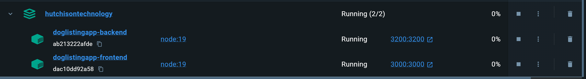
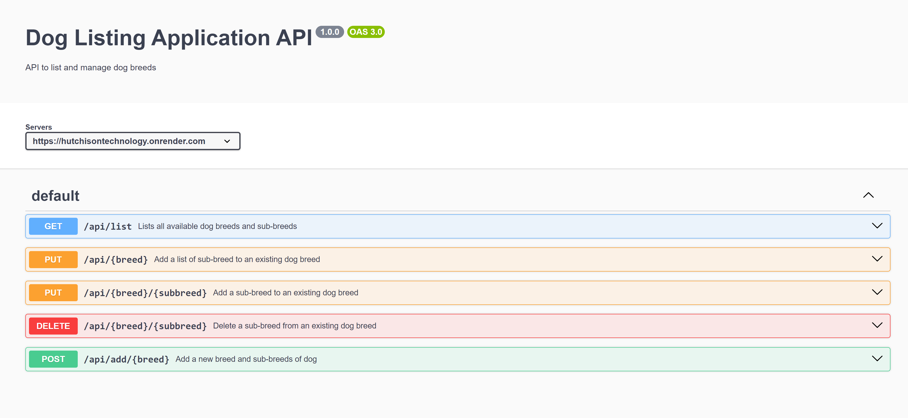
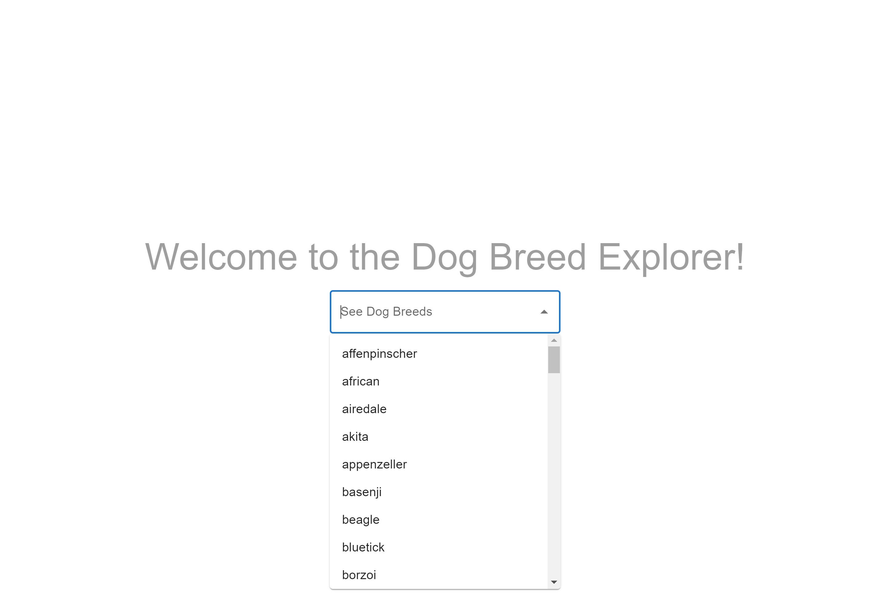
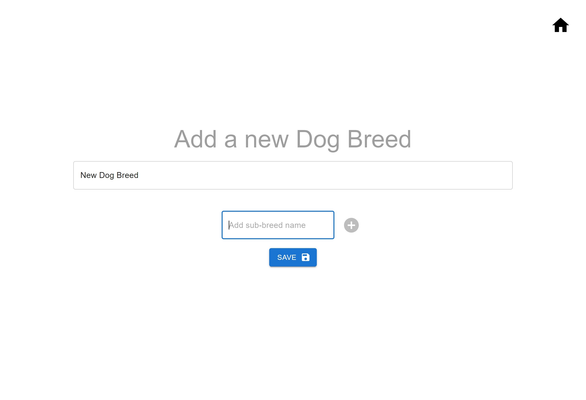
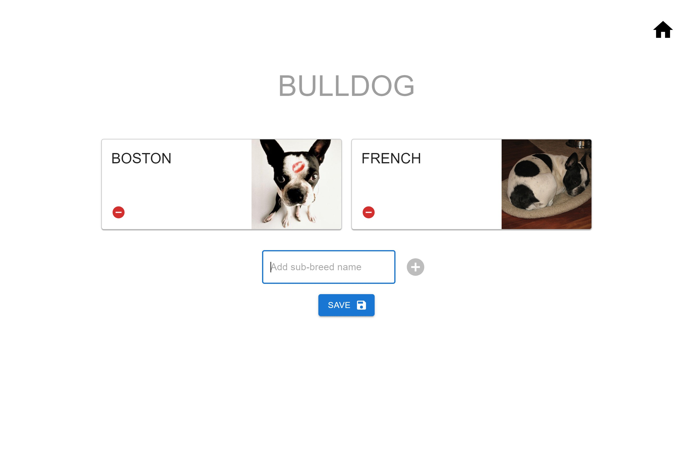
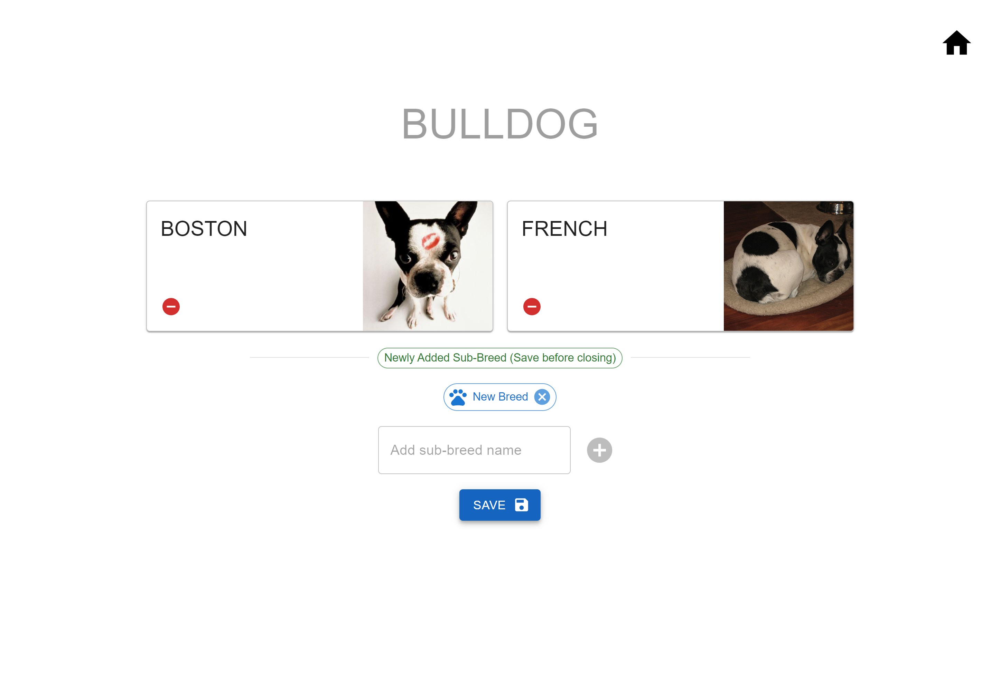
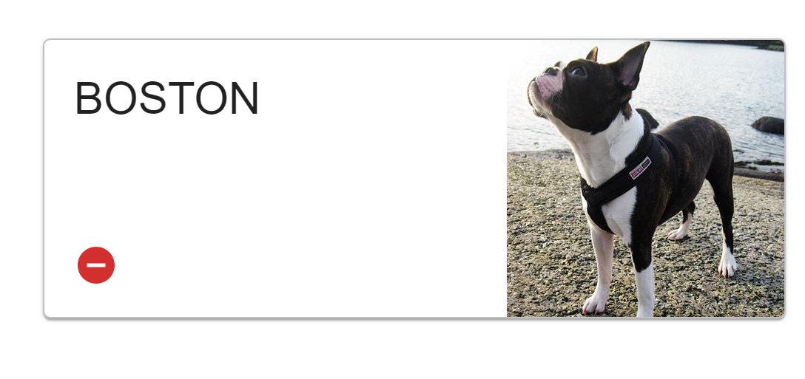

# Dog Listing Application - Backend Node Server

Welcome to the Dog Listing Application! This application allows users to explore various dog breeds and their sub-breeds. 
Below you'll find instructions on how to set up and run the application locally, as well as how to access the deployed version.

## Table of Contents

- [Features](#features)
- [Technologies Used](#technologies-used)
- [Local Development](#local-development)
- [Deployment on Render](#deployment-on-render)
- [API Endpoints with Swagger](#api-endpoints)


## Features

- View full list of dog breeds.
- Fetch specific breeds and their sub-breeds.
- Add new Breed and Sub-breed 
- Delete any sub-breed from the list for any breed 
- Persist every chnage made in the UI even after re-opening the website

## Technologies Used

**Backend Server**
- Node.js
- Express.js
- Swagger OpenApi
- Docker

**Frondend UI**: Tools and Libraries
- **Frontend**: Node, React, Material-UI for styling, providing a responsive design. Additionally, Emotion is used for styling.

- **State Management**: React Context API was used to handle state across the application. 

- **TypeScript**: The project is written in TypeScript. This enhances code quality, provides better tooling support, and helped catch errors during development.

- **Linting**: ESLint is used to maintain code quality, following industry-standard coding conventions.

- **Error Handling with Error Boundary** : The application is equipped with custom error boundary, which serves as a safety net to catch and gracefully handle errors that might occur during runtime.


## Local Development

To run the application locally using Docker, follow these steps:

1. **Clone the Repository:**
   ```bash
   git clone https://github.com/Mohamed-rilwan/HutchisonTechnology
   ```

2. **Running using docker compose**
If you prefer to run the application using Docker Compose, follow these instructions. The root directory of the project contains  `docker-compose.yml`.

 Steps to Run the Application with Docker Compose
   ```bash
   cd HutchisonTechnology
   ```
   To build and run the frontend and backedn application usin docker, run the following command
   ```
   docker compose up --build
   ```
The application should start the services on the specified ports in your Docker engine. You can access:

Backend: http://localhost:3200; 
Frontend: http://localhost:3000




## Deployment on Render 
I’ve deployed the backend of the application using Render's free tier. Please note that free instances will spin down during periods of inactivity, which can result in a delay of 50 seconds or more for the first request after being idle.

**NOTE**: Since the service may experience spin-downs due to inactivity, I recommend allowing a little time for the first request, especially after a period of no activity.


### Accessing the Deployed Service
You can access the deployed service at the following URL:

Backend Server : https://hutchisontechnology.onrender.com

Frontend UI :   https://hutchisontechnology-doglistingapp.onrender.com


## API Endpoints
This project uses Swagger to document and test API endpoints, providing an interactive interface to explore each endpoint’s functionality. You can see the list of endpoint when you access the backend server on  https://hutchisontechnology.onrender.com 

(Note: Initial load might take upto a minute as the applicaiton gets into inactive state when not accessed for a while)



Here you can view all available API routes, parameters, and expected responses which are clearly documented. Each endpoint can be tested directly from the Swagger interface.


## Working with the Application

Frontend UI :   https://hutchisontechnology-doglistingapp.onrender.com

Upon loading, the application displays a simple welcome message, followed by a dropdown menu listing all available dog breeds from the data.json file.



The home screen allows you to do two things
- **Add a New Dog Breed and Sub-breeds**:
Users can enter a breed name and add multiple sub-breeds. Once saved, this new breed and its sub-breeds will persist and appear every time the application is loaded.


- **View Existing Dog Breed Details**
Selecting a breed from the dropdown navigates to a details page, displaying:
   - The selected breed's name
   - Cards for each sub-breed (if available)
   - A sample photo of each sub-breed fetched from a publicly available API (Note: This image changes every time the page is refreshed).




### Breed Details Page Operations
On the breed details page, you can:

1. **Add New Sub-breeds** - Users can add sub-breeds to the currently selected breed.
 
2. **Remove Existing Sub-breeds** - Users can remove a sub-breed by clicking the "Remove" button on its respective card.



